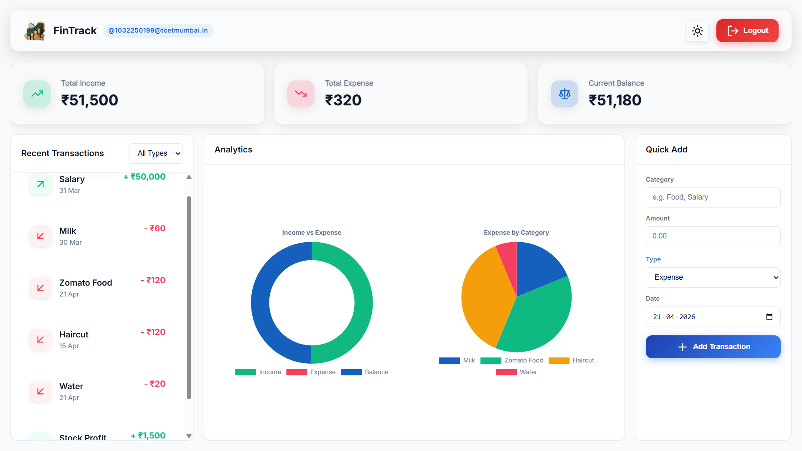
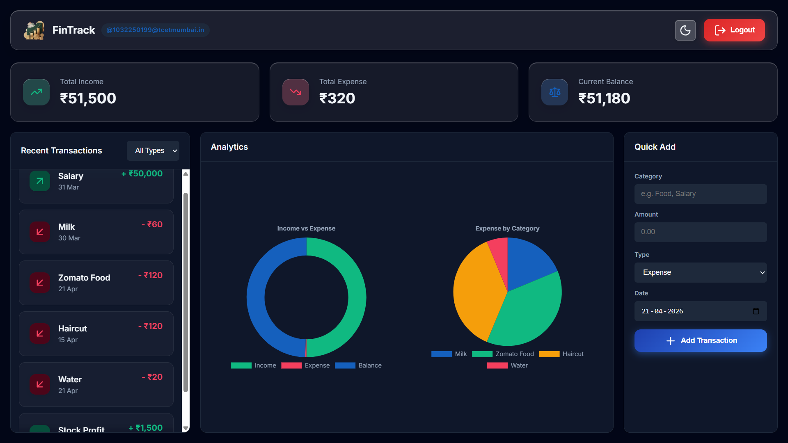

# FinTrack

## Overview
Personal finance tracker web app built with Flask and MySQL. Track your income and expenses, categorize transactions, view interactive dashboards and charts.

## Features
- **User Authentication**: Secure register/login system
- **Transaction Management**: Add, edit, delete, search/filter transactions
- **Categories**: Organize expenses by category (Food, Transport, etc.)
- **Dashboard**: Real-time income, expense, balance overview
- **Interactive Charts**: Pie charts for category breakdown, bar charts for monthly trends
- **Responsive Design**: Works on desktop and mobile

## Screenshots
### Light Theme


### Dark Theme


## Local Setup

### Prerequisites
- Python 3.8+
- MySQL Server running on localhost
- MySQL client (Workbench, phpMyAdmin, etc.)

### Database Setup
1. Create database: `CREATE DATABASE finance_db;`
2. Run the schema: Execute `db.sql` file in your MySQL client to create `Users` and `Transactions` tables.

### Application Setup
1. Install dependencies:
   ```
   pip install -r requirements.txt
   ```
2. (Optional) Update database credentials in `app.py`:
   ```python
   host="localhost",
   user="root",
   password="your_password",
   database="finance_db"
   ```
3. Run the application:
   ```
   python app.py
   ```
4. Open your browser: **http://127.0.0.1:5000/**

### Usage
1. Register a new account
2. Login
3. Add income/expense transactions
4. View dashboard and charts
5. Filter/search transactions

## Tech Stack
- **Backend**: Flask, MySQL
- **Frontend**: HTML/CSS/JavaScript (vanilla)
- **Features**: Charts.js (via CDN)

© 2026 FinTrack. All rights reserved.
